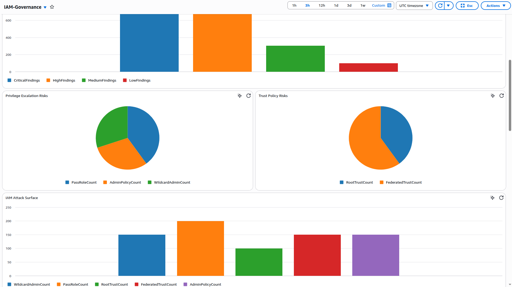

<div align="center">

# ☁️ CSP — Cloud Security Platform

**An AWS-native, serverless security governance platform for continuous cloud posture management**

[](https://golang.org/)
[](https://www.terraform.io/)
[](https://aws.amazon.com/lambda/)
[](https://aws.amazon.com/dynamodb/)
[](LICENSE)

</div>

---

## Overview

**CSP (Cloud Security Platform)** is a fully serverless, event-driven AWS security governance solution built in Go and deployed via Terraform. It continuously scans your AWS environment across multiple services — IAM, EC2, S3, VPC, RDS, EKS, and CloudTrail — detecting misconfigurations, privilege escalation paths, public exposures, and compliance gaps in real time.

All findings are centralized in DynamoDB, scored with a quantitative risk model, visualized in a CloudWatch executive dashboard, and delivered through automated SNS alerting — with zero manual intervention.

---

## Business Impact

| Outcome | Detail |
|---|---|
| **10+ Security Scan Engines** | IAM, EC2, S3, VPC, RDS, EKS, CloudTrail, Root Monitor, Access Key Audit, Privilege Escalation, Trust Analyzer |
| **1,000+ Findings Capacity** | Centralized DynamoDB governance dataset for reporting and historical analysis |
| **IAM Security Score (0–100)** | Quantitative risk posture score based on finding severity and exposure |
| **25+ CloudWatch Metrics** | Real-time visibility into attack surface, privilege escalation, public exposure, and encryption gaps |
| **Fully Automated** | EventBridge scheduling eliminates manual audit cycles |
| **Executive Dashboard** | Leadership-ready CloudWatch dashboard covering all risk domains |

---

## Architecture

```
                        ┌─────────────────────────────┐
                        │        AWS Environment      │
                        │  IAM · EC2 · S3 · VPC · RDS │
                        │      EKS · CloudTrail       │
                        └──────────────┬──────────────┘
                                       │
          ┌────────────────────────────┼────────────────────────────┐
          │                            │                            │
          ▼                            ▼                            ▼

┌──────────────────┐       ┌──────────────────┐       ┌──────────────────┐
│  IAM Analyzers   │       │  Service Scanners│       │  Root & Key Audit│
│                  │       │                  │       │                  │
│ • Inventory      │       │ • EC2 Scanner    │       │ • Root Monitor   │
│ • Risk Analyzer  │       │ • S3 Scanner     │       │ • Access Key     │
│ • Trust Analyzer │       │ • VPC Scanner    │       │   Audit          │
│ • Priv. Escalation│      │ • RDS Scanner    │       └────────┬─────────┘
│ • Access Key Audit│      │ • EKS Scanner    │                │
└────────┬─────────┘       │ • CloudTrail     │                │
         │                 └────────┬─────────┘                │
         └──────────────────────────┼──────────────────────────┘
                                    │
                                    ▼
                       ┌──────────────────────────┐
                       │  DynamoDB Findings Store │
                       │  iam-security-findings   │
                       └────────────┬─────────────┘
                                    │
                                    ▼
                       ┌────────────────────────┐
                       │    Report Generator    │
                       │    (Lambda · Go)       │
                       └────────────┬───────────┘
                                    │
               ┌────────────────────┼────────────────────┐
               │                    │                    │
               ▼                    ▼                    ▼
   ┌──────────────────┐  ┌──────────────────┐  ┌──────────────────┐
   │ CloudWatch       │  │ CloudWatch       │  │ SNS Alerts       │
   │ Metrics (25+)    │  │ Dashboard        │  │ (Email / Events) │
   └──────────────────┘  └──────────────────┘  └──────────────────┘
```

---

## Work Flow Architecture

```

                               +----------------------+
                               |   AWS Account        |
                               | (Resources to Scan)  |
                               +----------+-----------+
                                          |
        -----------------------------------------------------------------
        |        |        |        |        |        |         |          |
       EC2      S3       VPC      RDS      EKS   CloudTrail   IAM      Root
        |        |        |        |        |        |         |          |
        -----------------------------------------------------------------
                                          ^
                                          |
                           EventBridge (Every 6 Hours)
                                          |
                                          v
+--------------------------------------------------------------------------------+
|                           Lambda Security Scanners                             |
|--------------------------------------------------------------------------------|
| EC2 Scanner       S3 Scanner        VPC Scanner      RDS Scanner               |
| EKS Scanner       CloudTrail        Root Monitor                           |
| Access Key Audit  Inventory         Privilege Escalation Scanner              |
+--------------------------------------+-----------------------------------------+
                                       |
                                       | Findings
                                       v
                          +-------------------------------+
                          | DynamoDB                      |
                          | iam-security-findings         |
                          +---------------+---------------+
                                          |
                     ----------------------------------------
                     |                    |                 |
                     |                    |                 |
                     v                    v                 v
        +------------------+   +----------------+   +------------------+
        | Report Generator |   | SNS Alerts     |   | Risk Analyzer    |
        | (2 min / Daily)  |   | Critical Only  |   | IAM Risk Logic   |
        +---------+--------+   +--------+-------+   +------------------+
                  |                     |
                  |                     |
                  v                     v
         CloudWatch Metrics         SNS Topic
                  |                     |
                  |                     |
                  v                     v
        +--------------------+     Email Notifications
        | CloudWatch         |
        | Dashboard          |
        | Security Score     |
        | Findings           |
        | Trends             |
        +--------------------+

                         Separate Analysis Engine
                         ------------------------
                                   |
                                   v
                      +---------------------------+
                      | Attack Graph Engine       |
                      | IAM Roles & Policies      |
                      | Privilege Paths           |
                      +---------------------------+


```

---

## Deep Architecture

```
                                  +------------------------------------------------------+
                                  |                 AWS Cloud Account                    |
                                  +------------------------------------------------------+
                                                              |
                                                              |
                                        +---------------------+----------------------+
                                        |                                            |
                                        | Terraform Provisioning                     |
                                        |                                            |
                                        +---------------------+----------------------+
                                                              |
      ---------------------------------------------------------------------------------------------------------
      |                    |                    |                    |                    |                   |
 IAM Roles          EventBridge          DynamoDB             SNS              CloudWatch Dashboard      Lambda Layer
 Lambda IAM         Schedulers        Findings Storage      Notifications          Metrics               AWS SDK Go
 Policies
      |
      |
      v
===============================================================================================================
                                   EVENT-DRIVEN SECURITY SCANNING LAYER
===============================================================================================================

                        Every 6 Hours
                              |
                              |
                      +----------------+
                      | EventBridge    |
                      +--------+-------+
                               |
         ----------------------------------------------------------------------------------------------
         |          |          |          |          |           |            |            |          |
         |          |          |          |          |           |            |            |          |
         v          v          v          v          v           v            v            v          v

 +-----------+ +-----------+ +-----------+ +-----------+ +-----------+ +-----------+ +-----------+ +-----------+
 |EC2 Scanner| |S3 Scanner | |VPC Scanner| |RDS Scanner| |EKS Scanner| |CloudTrail| |Root Monitor| |Access Key |
 +-----------+ +-----------+ +-----------+ +-----------+ +-----------+ +-----------+ +-----------+ +-----------+
       |             |             |             |             |             |              |           |
       |             |             |             |             |             |              |           |
       --------------------------------------------------------------------------------------------------
                                               |
                                               |
                                               v

                                      +----------------------+
                                      | IAM Inventory        |
                                      +----------------------+
                                               |
                                               |
                                               v

                                 +-------------------------------+
                                 | Privilege Escalation Scanner  |
                                 +-------------------------------+
                                               |
                                               |
                                               v

===============================================================================================================
                                         SCANNING ENGINE
===============================================================================================================

Every Scanner Performs

      AWS SDK API Calls
              |
              v

Resource Enumeration

      EC2
      S3
      IAM
      VPC
      CloudTrail
      RDS
      EKS

              |
              v

Security Rule Evaluation

      Public Resources
      Encryption
      MFA
      Root Login
      Wildcard Admin
      PassRole
      Trust Policies
      Old Keys
      Open SG
      CloudTrail Disabled

              |
              v

Generate Finding Object

{
 ResourceID
 ResourceName
 FindingType
 Severity
 Message
 Timestamp
}

              |
              v

Store Finding

              |
              v

+-------------------------------------------+
| DynamoDB                                  |
| iam-security-findings                     |
+-------------------------------------------+

Partition Key  : resource_id
Sort Key       : finding_type

===============================================================================================================
                                      ANALYTICS ENGINE
===============================================================================================================

                      Every 2 Minutes / Daily

                               |
                               |
                         Report Generator
                               |
          ---------------------------------------------------
          |                    |                            |
          |                    |                            |
          v                    v                            v

 Calculate Score       Aggregate Findings             Count Risks

 Critical
 High
 Medium
 Low

 Wildcard Admin
 PassRole
 Root Trust
 Public Bucket
 Public EC2
 Public RDS
 Public EKS
 Open SG
 IMDSv1
 Root Login
 Old Keys

          |
          |
          v

Publish CloudWatch Metrics

          |
          |
          v

+-----------------------------------------------------------+
| CloudWatch Dashboard                                      |
|-----------------------------------------------------------|
| Security Score                                            |
| Total Findings                                            |
| Critical Findings                                         |
| High Findings                                             |
| Medium Findings                                           |
| Severity Distribution                                     |
| Security Score Trend                                      |
| Findings Timeline                                         |
| IAM Attack Surface                                        |
| Trust Policy Risk                                         |
| Privilege Escalation                                      |
| Public Exposure                                           |
| Encryption Issues                                         |
| Network Security                                          |
+-----------------------------------------------------------+

===============================================================================================================
                                      ALERTING ENGINE
===============================================================================================================

                  DynamoDB Findings
                          |
                          |
                          v

                  SNS Alert Lambda

                          |
              Only CRITICAL Findings
                          |
                          v

                  SNS Topic

                          |
                          v

                 Email Notification

===============================================================================================================
                                   ADVANCED SECURITY ENGINE
===============================================================================================================

                        IAM Roles
                            |
                            |
                            v

                 Attack Graph Engine

                            |
             Download IAM Policies
                            |
                            v

          Build Relationship Graph

 Role
      |
      +-----> Wildcard Admin

 Role
      |
      +-----> PassRole
                    |
                    +-----> Lambda
                    |
                    +-----> EC2

 Role
      |
      +-----> Admin

                            |
                            v

                     attack-graph.json

===============================================================================================================
                                        DATA FLOW
===============================================================================================================

                 AWS Resources
                        |
                        v
                EventBridge Scheduler
                        |
                        v
              Lambda Security Scanners
                        |
                        v
                DynamoDB Findings
                        |
          ---------------------------------
          |               |               |
          |               |               |
          v               v               v
   Report Generator   SNS Alerts   Attack Graph
          |                              |
          |                              |
          v                              |
 CloudWatch Metrics                      |
          |                              |
          v                              |
 CloudWatch Dashboard <-------------------

```

---

## Security Scan Engines

### IAM Governance

| Engine | What It Detects |
|---|---|
| **Inventory Engine** | IAM Users, Roles, Policies, and trust surface mapping |
| **Privilege Escalation Engine** | `iam:PassRole + lambda:CreateFunction`, `PassRole + ec2:RunInstances`, `iam:AttachRolePolicy + CreatePolicyVersion`, full wildcard admin |
| **Risk Analyzer** | `Action=*`, `Resource=*`, `iam:*`, `AdministratorAccess` policy attachments |
| **Trust Analyzer** | Wildcard principals, root trust relationships, federated identity risks, cross-account exposure |
| **Access Key Audit** | Multiple active keys, keys older than 90 days, unused and inactive keys |

### Cloud Infrastructure

| Engine | What It Detects |
|---|---|
| **EC2 Scanner** | Public instances with unrestricted SSH, IMDSv1 enabled |
| **S3 Scanner** | Publicly accessible buckets, encryption disabled |
| **VPC Scanner** | Security groups exposing `0.0.0.0/0` |
| **RDS Scanner** | Publicly accessible RDS instances, encryption gaps |
| **EKS Scanner** | Public API server endpoints |
| **CloudTrail Scanner** | CloudTrail logging disabled |
| **Root Monitor** | Root account console login activity |

---

## Security Scoring Model

The platform computes a continuous **IAM Security Score (0–100)** based on active findings:

| Severity | Score Deduction |
|---|---|
| 🔴 Critical | −20 per finding |
| 🟠 High | −10 per finding |
| 🟡 Medium | −5 per finding |
| 🔵 Low | −2 per finding |

A score of **100** represents a clean IAM posture. Scores are published to CloudWatch every 2 minutes for trend tracking.

---

## Severity Classification

### Critical
- Wildcard administrative permissions (`Action=* Resource=*`)
- Full `AdministratorAccess` policy attached
- Privilege escalation attack paths (PassRole → Lambda / EC2)
- Wildcard trust principals
- Public S3 buckets with anonymous access
- CloudTrail logging disabled
- Root console login events

### High
- Root trust relationships
- PassRole risks
- Cross-account trust exposure
- EC2 instances with public IP and open SSH
- RDS instances publicly accessible
- EKS API endpoint publicly accessible
- S3 encryption disabled
- Open security groups (`0.0.0.0/0`)
- Inactive or stale access keys

### Medium
- Federated identity trust without restrictive conditions
- Multiple active access keys per user
- IMDSv1 enabled on EC2 instances
- Access keys older than 90–180 days

### Low
- Permissions unused for 90+ days

---

## CloudWatch Dashboard

The executive dashboard covers the following panels:

| Panel | Metric |
|---|---|
| Security Score | Live score with trend |
| Total / Critical / High / Medium Findings | KPI single-value widgets |
| Security Score Trend | Time series |
| Findings Growth Rate | Time series |
| Severity Distribution | Bar chart |
| Privilege Escalation Risks | Pie chart (PassRole, AdminPolicy, WildcardAdmin) |
| Trust Policy Risks | Pie chart (RootTrust, FederatedTrust) |
| IAM Attack Surface | Bar chart |
| Findings by Service | Bar chart (IAM, EC2, S3, VPC, RDS, EKS, CloudTrail) |
| Critical Risk Types | Pie chart (PublicBucket, PublicEC2, CloudTrailDisabled, PrivEsc, RootLogin) |
| Cloud Exposure | Pie chart (S3, EC2, RDS, EKS, SecurityGroups) |
| Root Activity | Count |
| Old Access Keys | Count |
| Privilege Escalation | Count |
| Publicly Exposed Resources | Bar chart |
| Encryption Issues | Pie chart (S3, RDS) |
| Network Security | Pie chart (Open SGs, IMDSv1) |
| Findings Timeline | Time series |

---

## CloudWatch Metrics Published

```
IAMGovernance/SecurityScore
IAMGovernance/TotalFindings
IAMGovernance/CriticalFindings
IAMGovernance/HighFindings
IAMGovernance/MediumFindings
IAMGovernance/LowFindings
IAMGovernance/WildcardAdminCount
IAMGovernance/PassRoleCount
IAMGovernance/RootTrustCount
IAMGovernance/FederatedTrustCount
IAMGovernance/AdminPolicyCount
IAMGovernance/PublicBucketCount
IAMGovernance/PublicInstanceCount
IAMGovernance/PublicRDSCount
IAMGovernance/PublicEKSCount
IAMGovernance/OpenSecurityGroupCount
IAMGovernance/S3EncryptionDisabled
IAMGovernance/RDSEncryptionDisabled
IAMGovernance/IMDSv1EnabledCount
IAMGovernance/CloudTrailDisabledCount
IAMGovernance/RootLoginCount
IAMGovernance/OldAccessKeyCount
IAMGovernance/PrivilegeEscalationCount
IAMGovernance/EC2Findings
IAMGovernance/S3Findings
IAMGovernance/VPCFindings
IAMGovernance/RDSFindings
IAMGovernance/EKSFindings
IAMGovernance/CloudTrailFindings
IAMGovernance/IAMFindings
```

---

## Automation Schedule

| Workflow | Trigger | Frequency |
|---|---|---|
| EC2 / S3 / VPC / RDS / EKS Scanners | EventBridge | Every 6 hours |
| IAM Analyzers (Inventory, Risk, Trust, PrivEsc, Access Keys) | EventBridge | Daily |
| Report Generator & Dashboard Metrics | EventBridge | Every 2 minutes |

---

## DynamoDB Findings Schema

All findings are stored in `iam-security-findings`:

| Attribute | Type | Description |
|---|---|---|
| `resource_id` | String (PK) | Unique identifier of the affected resource |
| `finding_type` | String (SK) | Type of security finding (e.g. `WildcardAdmin`, `PublicBucket`) |
| `resource_name` | String | Human-readable resource name |
| `severity` | String | `CRITICAL` / `HIGH` / `MEDIUM` / `LOW` |
| `message` | String | Description of the finding |
| `detected_at` | String | ISO 8601 timestamp |

---

## Technology Stack

| Layer | Technology |
|---|---|
| **Language** | Go (compiled to Lambda `provided.al2023` runtime) |
| **Compute** | AWS Lambda |
| **Data Store** | Amazon DynamoDB |
| **Scheduling** | Amazon EventBridge |
| **Observability** | Amazon CloudWatch (Metrics + Dashboard) |
| **Alerting** | Amazon SNS |
| **Identity** | AWS IAM |
| **Infrastructure as Code** | Terraform >= 1.5 |

---

## Repository Structure

```
.
├── lambda/
│   ├── inventory/              # IAM inventory & attack surface mapping
│   ├── risk_analyzer/          # Policy risk analysis (wildcards, admin policies)
│   ├── trust_analyzer/         # Trust relationship evaluation
│   ├── privilege_escalation/   # PassRole and privilege escalation paths
│   ├── access_key_audit/       # Access key hygiene
│   ├── ec2_scanner/            # EC2 public exposure, IMDSv1
│   ├── s3_scanner/             # S3 public access, encryption
│   ├── vpc_scanner/            # Security group analysis
│   ├── rds_scanner/            # RDS public access, encryption
│   ├── eks_scanner/            # EKS public endpoint detection
│   ├── cloudtrail_scanner/     # CloudTrail audit status
│   ├── root_monitor/           # Root account activity
│   ├── report_generator/       # Aggregates findings, publishes metrics
│   ├── scoring/                # IAM Security Score computation
│   └── sns_alerts/             # SNS notification dispatch
│
├── terraform/
│   ├── lambda.tf               # Lambda function definitions (IAM engines)
│   ├── s3.tf                   # S3 scanner Lambda + EventBridge
│   ├── ec2.tf                  # EC2 scanner Lambda + EventBridge
│   ├── vpc.tf                  # VPC scanner Lambda + EventBridge
│   ├── rds.tf                  # RDS scanner Lambda + EventBridge
│   ├── eks.tf                  # EKS scanner Lambda + EventBridge
│   ├── iam.tf                  # IAM roles and policies
│   ├── dynamodb.tf             # DynamoDB findings table
│   ├── sns.tf                  # SNS topics and subscriptions
│   ├── dashboard.tf            # CloudWatch dashboard + EventBridge schedule
│   └── outputs.tf              # Stack outputs
│
├── docs/
│   ├── demo-data/
│   │   └── seed_data_demo.tf   # Demo data seeder for dashboard testing
│   ├── IAM_Governance_Platform_Dashboard.png
│   ├── Lambda_Dashboard.png
│   ├── DynamoDB_Dashboard.png
│   ├── EventBridge_Dashboard.png
│   ├── CloudWatchLogs_Dashboard.png
│   └── CloudWatchUse_Dashboard.png
│
└── artifacts/                  # Compiled Lambda ZIP files (generated by build)
```

---

## Deployment

### Prerequisites

- AWS Account with sufficient IAM permissions to deploy Lambda, DynamoDB, SNS, EventBridge, and CloudWatch resources
- [Terraform](https://developer.hashicorp.com/terraform/install) >= 1.5
- [Go](https://go.dev/dl/) >= 1.21
- [AWS CLI](https://docs.aws.amazon.com/cli/latest/userguide/install-cliv2.html) configured (`aws configure`)

### Build Lambda Artifacts

Compile each Go Lambda function and place the ZIP files in the `artifacts/` directory:

```bash
# Example for one function — repeat for each Lambda
GOOS=linux GOARCH=amd64 go build -o bootstrap ./lambda/report_generator/
zip artifacts/report-generator.zip bootstrap
```

### Deploy with Terraform

```bash
# 1. Initialize providers and modules
terraform init

# 2. Preview the deployment plan
terraform plan

# 3. Deploy all infrastructure
terraform apply
```

### Seed Demo Data (Optional)

To populate the dashboard with representative findings for testing or demos:

```bash
terraform apply -target=aws_dynamodb_table_item.seed_findings
```

This seeds 1,500+ realistic findings across IAM, EC2, S3, VPC, RDS, EKS, and CloudTrail.

### Destroy Infrastructure

```bash
terraform destroy
```

---

## Alerting

SNS topics are configured for automated security notifications:

| Topic | Purpose |
|---|---|
| `iam-security-alerts` | General IAM security finding alerts |
| `iam-governance-alerts` | Governance scoring and report notifications |

Email subscriptions are configured at deployment time. Critical findings trigger immediate notifications via the SNS workflow.

---

## Dashboards

### IAM Governance Platform Dashboard
<p align="center">
  
</p>

<p align="center">
  
</p>

### CloudWatch Metrics Dashboard
<p align="center">
  
</p>

### Lambda Execution Dashboard
<p align="center">
  
</p>

### DynamoDB Findings Dashboard
<p align="center">
  
</p>

### EventBridge Scheduling Dashboard
<p align="center">
  
</p>

### CloudWatch Logs Dashboard
<p align="center">
  
</p>

---

## Example Finding Records

```json
{
  "resource_id": "wildcard-42",
  "finding_type": "WildcardAdmin",
  "resource_name": "FinanceAdminRole-42",
  "severity": "CRITICAL",
  "message": "Action=* Resource=* grants unrestricted administrative access",
  "detected_at": "2026-06-18T00:00:00Z"
}

{
  "resource_id": "s3-public-7",
  "finding_type": "PublicBucket",
  "resource_name": "public-bucket-7",
  "severity": "CRITICAL",
  "message": "Bucket allows anonymous public access.",
  "detected_at": "2026-06-18T00:00:00Z"
}

{
  "resource_id": "eks-public-12",
  "finding_type": "PublicEndpoint",
  "resource_name": "eks-12",
  "severity": "HIGH",
  "message": "EKS API endpoint is publicly accessible.",
  "detected_at": "2026-06-18T00:00:00Z"
}
```

---

## Security Outcomes

CSP enables engineering and security teams to:

- Continuously assess and track IAM security posture with a quantitative score
- Detect privilege escalation attack paths before adversaries can exploit them
- Identify publicly exposed cloud resources across EC2, S3, RDS, and EKS
- Monitor trust relationship exposure and cross-account risks
- Enforce access key hygiene and detect stale credentials
- Detect root account activity and CloudTrail gaps immediately
- Generate executive-level reporting and trend analytics
- Drive cloud identity and infrastructure security maturity at scale

---

## Roadmap

- [ ] AWS Security Hub integration
- [ ] AWS Config integration and conformance packs
- [ ] Cross-account IAM governance (multi-account Organizations support)
- [ ] Multi-region scanning support
- [ ] Automated remediation workflows (Lambda-triggered auto-fix)
- [ ] Graph-based attack path visualization
- [ ] Historical trend analytics and baseline drift detection
- [ ] Compliance mapping: CIS Benchmarks, NIST 800-53, ISO 27001

---

## License

This project is licensed under the [MIT License](LICENSE).

---

## Author

**Debasish Mohanty**

Cloud Security Engineer · AWS Security · IAM Governance · Threat Detection · Security Automation

[](https://linkedin.com)
[](https://github.com)
