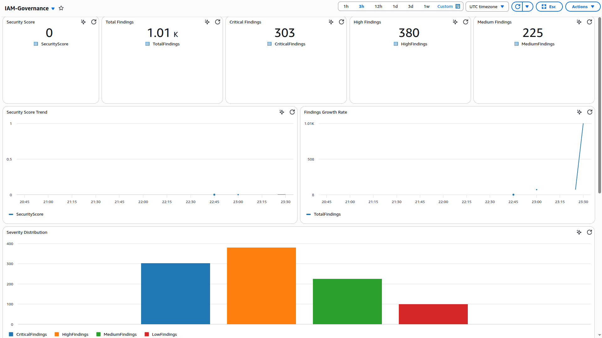
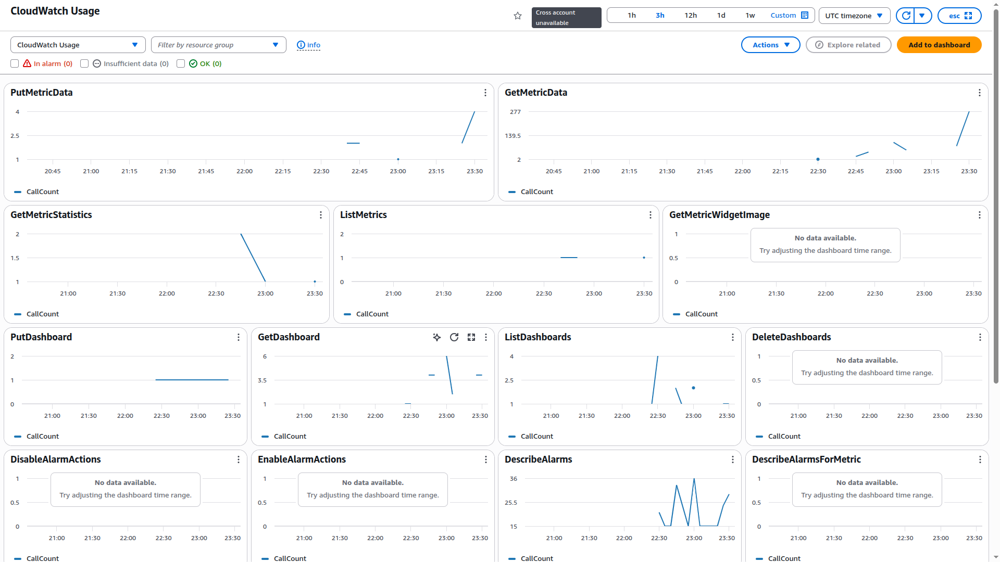
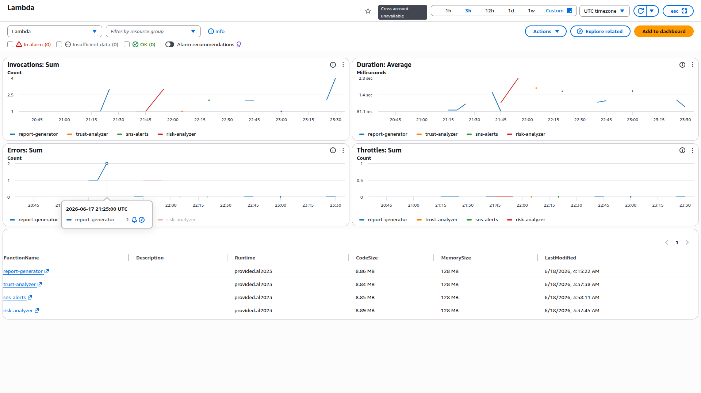
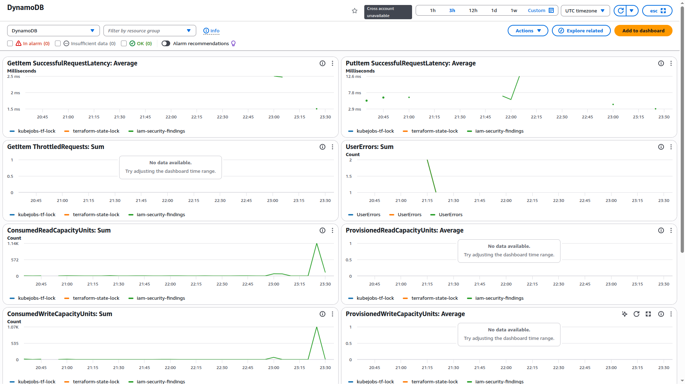
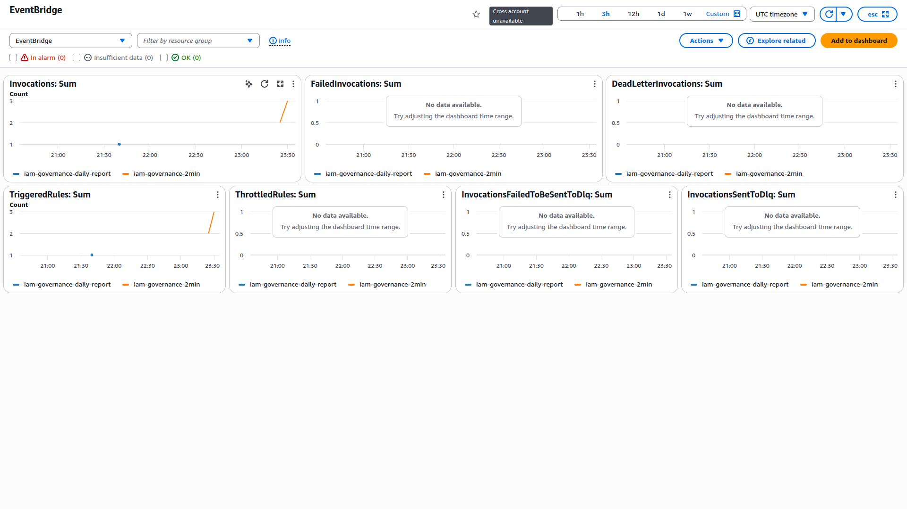
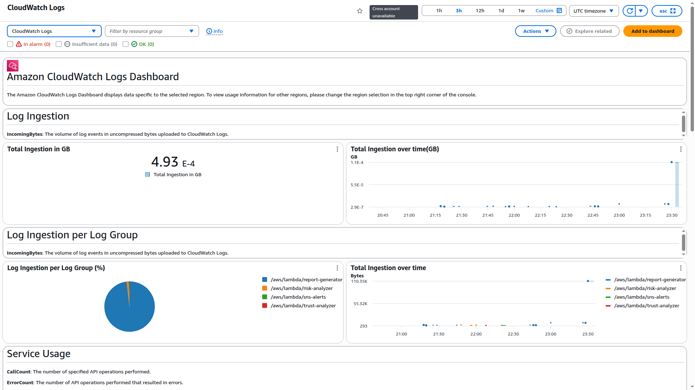

# IAM Governance Platform

## Overview

IAM Governance Platform is an AWS-native security governance and risk assessment solution designed to continuously analyze Identity and Access Management (IAM) configurations across AWS environments.

The platform identifies excessive permissions, privilege escalation paths, insecure trust relationships, access key risks, and administrative misconfigurations. Findings are centralized in DynamoDB, transformed into security metrics, visualized through CloudWatch dashboards, and distributed through automated alerting workflows.

The solution is built using Go, AWS Lambda, Terraform, DynamoDB, CloudWatch, EventBridge, SNS, and IAM APIs.

---

## Key Features

### IAM Inventory Analysis

Collects and analyzes:

* IAM Users
* IAM Roles
* IAM Policies
* Attached Role Policies
* Role Usage Information

Provides visibility into IAM attack surface and permission distribution.

---

### Privilege Escalation Detection

Identifies dangerous privilege escalation combinations including:

* iam:PassRole + lambda:CreateFunction
* iam:PassRole + ec2:RunInstances
* iam:AttachRolePolicy + iam:CreatePolicyVersion
* Full administrative wildcard permissions

Severity Classification:

| Risk Type             | Severity |
| --------------------- | -------- |
| Full Admin Access     | Critical |
| PassRole Abuse        | Critical |
| Policy Version Abuse  | Critical |
| EC2/Lambda Escalation | Critical |

---

### IAM Policy Risk Analysis

Analyzes attached role policies and detects:

* Action = "*"
* Resource = "*"
* iam:*
* AdministratorAccess usage
* Wildcard administrative privileges

Risk findings are automatically stored for reporting and scoring.

---

### Trust Policy Analysis

Evaluates IAM trust relationships and identifies:

* Wildcard principals
* Root account trust
* Federated trust configurations
* Potential cross-account exposure

Findings are classified and stored for governance reporting.

---

### Access Key Security Audit

Detects:

* Multiple active access keys
* Access keys older than 90 days
* Unused access keys
* Long inactive access keys

Supports continuous credential hygiene monitoring.

---

### Security Findings Repository

All security findings are centralized inside DynamoDB.

Stored Attributes:

* Resource ID
* Resource Name
* Finding Type
* Severity
* Policy Name
* Message
* Detection Timestamp

This creates a centralized governance dataset for reporting and analytics.

---

### Security Scoring Engine

Generates an overall IAM security posture score.

Scoring Model:

| Severity | Score Impact |
| -------- | ------------ |
| Critical | -20          |
| High     | -10          |
| Medium   | -5           |
| Low      | -2           |

Score Range:

0 - 100

Higher scores indicate stronger IAM governance posture.

---

### Automated Security Reporting

The reporting engine aggregates findings and produces:

* Total Findings
* Severity Distribution
* Risk Breakdown
* Governance Score

Reports are generated automatically through scheduled executions.

---

### CloudWatch Security Metrics

Custom CloudWatch Metrics:

* SecurityScore
* TotalFindings
* CriticalFindings
* HighFindings
* MediumFindings
* LowFindings
* WildcardAdminCount
* PassRoleCount
* RootTrustCount
* FederatedTrustCount
* AdminPolicyCount

---

### CloudWatch Executive Dashboard

Provides centralized visibility into:

* Security Score
* Finding Trends
* Severity Distribution
* Privilege Escalation Risks
* Trust Policy Risks
* IAM Attack Surface
* Security Trend Analysis

Designed for both engineering and leadership stakeholders.

---

### Event-Driven Automation

EventBridge schedules:

| Workflow                  | Frequency       |
| ------------------------- | --------------- |
| Governance Reporting      | Daily           |
| Dashboard Metrics Refresh | Every 2 Minutes |

Ensures continuous visibility without manual intervention.

---

### Security Alerting

SNS integration provides automated notifications for detected risks.

Supports:

* Email alerts
* Automated security notifications
* Governance monitoring workflows

---

## Architecture

```text
IAM Resources
      │
      ▼
+------------------------+
| Security Analyzers     |
|------------------------|
| Inventory Engine       |
| Risk Analyzer          |
| Trust Analyzer         |
| Access Key Audit       |
| Privilege Escalation   |
+------------------------+
      │
      ▼
DynamoDB Findings Store
      │
      ▼
Report Generator
      │
      ├────────► CloudWatch Metrics
      │
      ├────────► CloudWatch Dashboard
      │
      └────────► SNS Alerts
```

---

## Technology Stack

### Language

* Go

### Cloud Services

* AWS Lambda
* AWS IAM
* AWS DynamoDB
* Amazon SNS
* Amazon EventBridge
* Amazon CloudWatch

### Infrastructure as Code

* Terraform

---

## Repository Structure

```text
.
├── docs
│   ├── IAM_Governance_Platform_Dashboard.png
│   ├── Lambda_Dashboard.png
│   ├── DynamoDB_Dashboard.png
│   ├── EventBridge_Dashboard.png
│   ├── CloudWatchLogs_Dashboard.png
│   └── CloudWatchUse_Dashboard.png
│
├── lambda
│   ├── inventory
│   ├── risk_analyzer
│   ├── trust_analyzer
│   ├── privilege_escalation
│   ├── access_key_audit
│   ├── report_generator
│   ├── scoring
│   └── sns_alerts
│
└── terraform
    ├── lambda.tf
    ├── iam.tf
    ├── dynamodb.tf
    ├── sns.tf
    ├── eventbridge.tf
    ├── dashboard.tf
    └── outputs.tf
```

---

## Deployment

### Prerequisites

* AWS Account
* Terraform >= 1.5
* Go >= 1.25
* AWS CLI Configured

### Initialize Terraform

```bash
terraform init
```

### Review Changes

```bash
terraform plan
```

### Deploy Infrastructure

```bash
terraform apply
```

---
## IAM Governance Dashboard

<p align="center">
  
</p>

## CloudWatch Dashboard

<p align="center">
  
</p>

## Lambda Dashboard

<p align="center">
  
</p>

## DynamoDB Dashboard

<p align="center">
  
</p>

## EventBridge Dashboard

<p align="center">
  
</p>

## CloudWatch Logs Dashboard

<p align="center">
  
</p>

---

## Example Findings

### Critical

* Wildcard Administrative Permissions
* Full Administrator Access
* Privilege Escalation Paths
* Wildcard Trust Principals

### High

* Root Trust Relationships
* PassRole Risks
* Inactive Access Keys
* IAM Administrative Permissions

### Medium

* Federated Trust Risks
* Multiple Active Access Keys

---

## Security Outcomes

The platform enables organizations to:

* Continuously assess IAM security posture
* Detect privilege escalation opportunities
* Monitor trust relationship exposure
* Enforce access key hygiene
* Track governance trends over time
* Generate executive-level security reporting
* Improve cloud identity security maturity

---

## Future Enhancements

Planned roadmap:

* Security Hub Integration
* AWS Config Integration
* Cross-Account IAM Governance
* Multi-Region Support
* Automated Remediation Workflows
* Graph-Based Attack Path Visualization
* Historical Trend Analytics
* Compliance Mapping (CIS, NIST, ISO 27001)

---

## License

MIT License

---

## Author

Debasish Mohanty

Cloud Security Engineer | AWS Security | IAM Governance | Threat Detection | Security Automation
